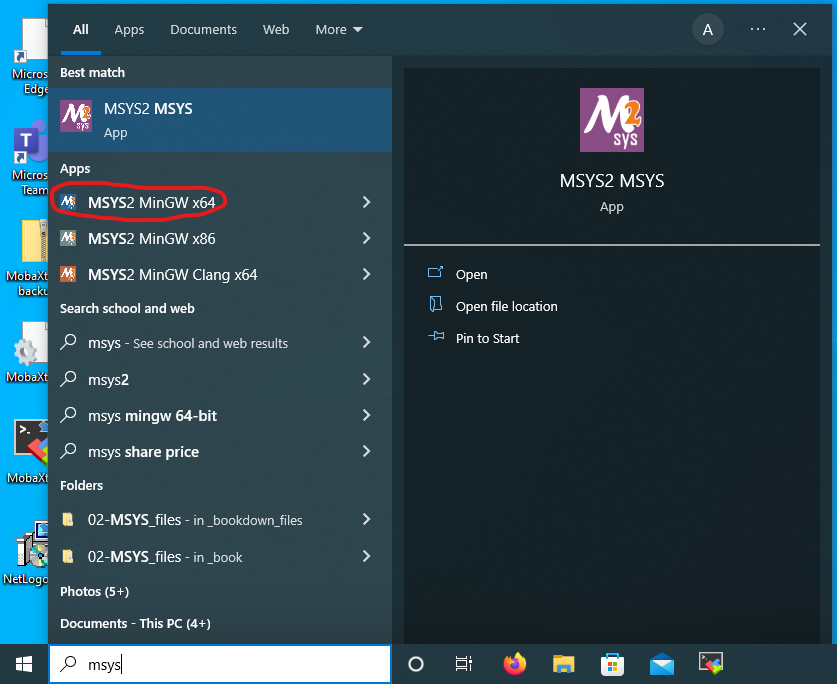
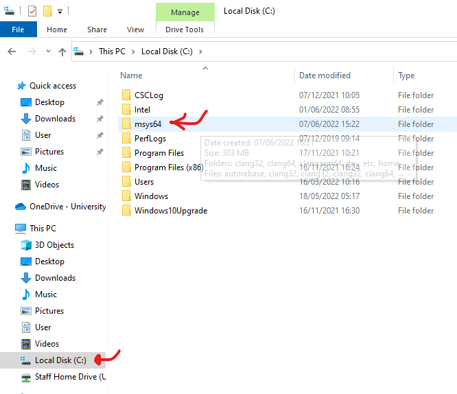

# Installing and using software to do your work
To do your research in theoretical or computational biology, you will need to install a bunch of software. I typically try to keep things as free and open access as possible, so that you don't have hassle with license fees. However, this is not always possible (e.g., research projects involving Mathematica or matlab).

## Finding out what software you need
Don't install *all* the software listed below. Rather contact me to discuss what software you need. Typically, you need one (or two) of the following options:

 1. The Rstudio environment
 2. A Python environment
 3. A C++ environment
 4. A Mathematica environment
 
## The Rstudio environment
R is a very commonly used programming environment and particularly useful for data analysis. Its disadvantages are that it is slow and that the programming language is arcane, to say the least. All pros and cons considered, if your project is data heavy, R is a great choice.

Rather than using the [absolute bare bones version of the programming environment R](https://cran.r-project.org/){target="_blank"}, we use [Rstudio](https://www.rstudio.com/), because it provides a full-blown IDE (integrated development environment) with text editor, variable inspector, file browswer and more. You can either use your web browser to go to the online [Rstudio server](https://rstudio01.cles.ex.ac.uk){target="_blank"} that is offered by the University of Exeter. Alternatively, you can choose to use a locally installed version of Rstudio (see below for installation instructions). If you don't know whether to choose the server-based version or the local installed he server-based version of Rstudio is probably the easiest to use, as it already has tons of packages pre-installed. However, if you have no uni access anymore or don't have continuous internet access, a locally installed version of Rstudio is best.


## Rstudio
### Using the web-based Rstudio server
You can simply access this by using your web browser. You can access the Rstudio server here:
[https://rstudio01.cles.ex.ac.uk](https://rstudio01.cles.ex.ac.uk){target="_blank"}, using your University of Exeter login. 

Once logged in, make sure to run the 4.x.x version, rather than a 3.x.x version. You can change versions on the top right of your Rstudio window within in your web browser. See the image below 

```{r figRstudioVersion, out.width="400pt", fig.cap="Changing the version in Rstudio online", echo=F}
knitr::include_graphics("images/screenshot_rstudio_version.png")
```


### Installing Rstudio on windows
If you have a Windows machine, the best way to install Rstudio is to download the [Desktop version](https://www.rstudio.com/products/rstudio/download/){target="_blank"}. 

### Installing Rstudio on a mac
A great way of keeping Rstudio up-to-date is to first install the Homebrew package manager
[Homebrew](https://brew.sh){target="_blank"}. This is a small program that allows you to install and update multiple programs on your Mac. Indeed, almost any research software that you will need on your Mac can be installed with homebrew. Using homebrew has the advantage that installation involves a single command, rather than you having to search for the correct version of the software online. Moreover, all installed packages will be updated to their latest versions by using two simple commands: `brew update`, following by `brew upgrade`.

### Installing homebrew
To install homebrew, you need to open the Terminal app (see [here](#MacTerminal) about where to find the Terminal app on your Mac). Once the terminal is open, copy the single-line install statement from the [Homebrew website](https://brew.sh/){target="_blank"} and paste it into the Terminal app. Then press 'Enter'. You will get a bunch of straightforward questions, after which homebrew installs itself.

### Installing Rstudio via homebrew
If you are on a mac, install Rstudio via homebrew:
```{bash eval=F}
brew install --cask rstudio
```

### Installing other applications via homebrew, such as the text editor textmate
After homebrew is installed, you can use it to install other applications. You can search for software available for install through homebrew by using the website [formulae.brew.sh](https://formulae.brew.sh). 

Let us install the [Textmate] text editor that we might need later. We do so using the [Terminal app](#MacTerminal) app, in which we type
```{bash eval=F}
brew install --cask textmate
```

### Updating all applications that have been installed via homebrew
This is where things get handier than installing all software individually:
```{bash eval=F}
brew update && brew upgrade
```


## Installing Python
For those of you who will need to install python (installing python is more the exception than the norm, hence ask if unsure), it is best to install the  [Anaconda](https://www.anaconda.com/products/individual){target="_blank"}  distribution, which provides the whole python bundle and comes with a package manager.


## Windows: Accessing remote servers using mobaxterm {#section:mobaxterm}
For some projects we need to access a remote server to run our software. For this we use the programme [mobaxterm](https://mobaxterm.mobatek.net/download.html). 

To install mobaxterm, watch this handy [video](https://www.youtube.com/watch?v=KRpgYS-eHj8&t=87s){target="_blank"}. Make sure you download the 'Portable version' rather than the 'Installer' version.

The `mobaxterm-xxx.exe` file can be ran from anywhere on your operating system (hence, the name 'Portable'). Hence, try to put in a location where you will not forget it. Alternatively make a shortcut to the mobaxterm-xxx.exe file (Right mouse click > create shortcut) and then drag the shortcut to the taskbar in Windows. See [this video](https://www.youtube.com/watch?v=3K9oYys-tYE) of some dude explaining how you can add a shortcut to the taskbar in Windows and more.

### Using Mobaxterm to access a remote location
Now let's use mobaxterm to access the remote server. See this video


## Installing software to develop C++ programs {#section:installcpp}
When working with the programming language C++, we will need to use the following software:

1. A UNIX Terminal (already installed on a mac, you will need to install on windows - see below)
2. A C++ compiler, which in our case will be `clang` on mac and `g++` on windows (see below).
3. A better-than-normal text editor. When on Windows, install the freely available text editor [Notepad++](){target="_blank"}. See the Notepad++ website for installation instructions. When on a mac, install an editor such as textmate (see below).
4. A software build environment like make or cmake.

## Yes, we really need a UNIX terminal.
You will need a UNIX terminal to access a broad collection of tools, namely the compiler `g++` o turn your C++ code into an executable programme, the command `git` to get code from repositories and `make` or `cmake` to automate the building of your code.

Sure, it would be possible to avoid a UNIX toolchain, by using Microsoft's Visual Studio or another compiler. However, chances are that we'll be running things on one of the University's Linux [computing clusters](https://universityofexeteruk.sharepoint.com/sites/CornwallARC) later on. If one has been working with Visual Studio, it typically is a massive pain to switch back to the different tools and compilers used on these Linux clusters, particularly when we would use associated libraries such as `gsl` or `eigen`. By contrast, when you already use a UNIX terminal on your local computer, moving to use the University's Linux cluster is very easy.

## Windows: install MSYS2 as our UNIX terminal
To get a UNIX terminal running on windows, we will install the [MSYS2](https://www.msys2.org/) environment. See [here](https://recapexeter.cloud.panopto.eu/Panopto/Pages/Viewer.aspx?id=f2acdf3c-224e-49be-8ae3-ad2400f2b3c1&start=0) for the installation video. There is also [another video](https://recapexeter.cloud.panopto.eu/Panopto/Pages/Viewer.aspx?id=376342e6-5791-4c25-b2e3-ad2400ffe304&start=0) that shows you how to subsequently work with the compiler, once installed.

### Accessing MSYS2 once installed
Once everything is installed, use the MSYS2 MinGW x64 executable, rather than the default MSYS2 executable. To start this, simply type `msys` in the windows search box (see screenshot) and the `x64` version will appear in the menu:
```{r figScreenShotMenu, fig.cap="Location of MSYS x64 in the windows menu. The default MSYS2 app will appear on top, but the x64 version can be found right below (red circle).", echo=F}

```


### Accessing MSYS2's home directory through Windows File Explorer {#section:MSYS2homedir}
The home directory in MSYS2 is indicated by the `~` sign, which points to a directory on your hard drive. However, the MSYS2 home directory is not the same as your Windows home directory! Rather, MSYS2's home directory `~` maps to something like `C:/msys64/home/$your_user_name`, rather than to the usual location of the windows home directory which is something like `C:/Users/$your_user_name/home`, where you need to replace `$your_user_name` with your windows user name.


Knowing that `~` is somewhere else than the standard home directory, you can still use the [Windows File Explorer](https://support.microsoft.com/en-us/windows/find-and-open-file-explorer-ef370130-1cca-9dc5-e0df-2f7416fe1cb1#WindowsVersion=Windows_10) to access this location and inspect the files present in `~`. Click the `This PC` in the left column of the Windows File Explorer and go to `C:/msys64/home/$your_user_name`. Here an example screenshot to clarify matters:
```{r figWindowsExplorer, out.width="500pt", fig.cap="Accessing the contents of the `msys64` directory via Windows File Explorer. Later on, the simulation code and simulation output will be found within this directory (in particular, within its `home` directory).", echo=F}

```


### Installing a command-line C++ compiler within MSYS2
Rather than using any C++ compiler like Visual Studio or Code Blocks, we use the compiler [g++](https://gcc.gnu.org/), as that compiler is the same as used on our computing clusters. To install it, see the instruction video [here](https://recapexeter.cloud.panopto.eu/Panopto/Pages/Viewer.aspx?id=f2acdf3c-224e-49be-8ae3-ad2400f2b3c1&start=0).


### Installing `git` within MSYS2
We need `git` to download and synchronize code repositories. To install `git` within MSYS2 type the command
```{bash eval=F}
pacman -S git
```

### Windows: use notepad++ as your text editor of choice
To edit and inspect source files, please **do not** use the standard text editor on windows, which is  [notepad](https://apps.microsoft.com/store/detail/windows-notepad/9MSMLRH6LZF3?hl=en-us&gl=US){target="_blank"}. This crippled and lame editor cannot read source files with line endings that are used on different operating systems like linux or mac. Moreover, it does not have syntax colouring, which is a life saver when reading code.

Hence, please install the free editor Notepad++ which provides syntax colouring and more. 
You can download a copy of Notepad++ [here](https://notepad-plus-plus.org/downloads/){target="_blank"}.

If you don't like Notepad++, have a google yourself. Any code editor that supports syntax coloring of C++,R,Python files and supports `CR/LF` and `LF` line endings should be OK.

## Mac: a UNIX terminal is provided via the Terminal app within the Applications/Utilities folder
To use the UNIX toolchain on a mac, you will need to use a UNIX terminal. Luckily this is installed as per default on any mac distribution. You can find the Terminal app in the `Applications` > `Utilities` folder on your hard drive. See Apple's support page [here](https://support.apple.com/en-gb/guide/terminal/apd5265185d-f365-44cb-8b09-71a064a42125/mac){target="_blank"} for more information on how to open this application.

### Mac: Install `g++` and `git`
In order to install g++ on a Mac, you need to follow [quite some  instructions](https://www.freecodecamp.org/news/install-xcode-command-line-tools/). Once this is installed `g++` is installed, as is `git`. 

### Mac: install a text editor like textmate
You can find Download textmate [here](https://macromates.com/){target="blank"}. If you don't like textmate, find any other code editor that supports syntax coloring of C++,R,Python files and supports `CR/LF` and `LF` line endings.
