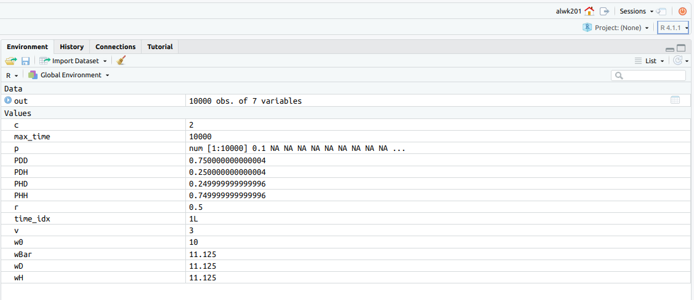

# Installing and using software to do your work
To do your research in theoretical or computational biology, you will need to install a bunch of software. I typically try to keep things as free and open access as possible, so that you don't have hassle with license fees. This is particularly importnat if you would like to continue working on projects (to publish papers) after you have graduated. However, this is not always possible as a good open-source replacement is sometimes not easy to find (e.g., Mathematica).

## Finding out what software you need
Don't install *all* the software listed below. Rather contact me to discuss what software you need. Typically, you need one (or two) of the following options:

 1. The Rstudio environment
 2. A Python environment
 3. A local C++ environment
 4. A Mathematica environment
 5. A remote environment (i.e., access to servers to run R/Python/C++)

If you would like to work using different software packages (e.g., [Julia](https://julialang.org/) , [Netlogo](https://ccl.northwestern.edu/netlogo/)) that is fine too, but I am less familiar with those packages so you would be on your own. I am less keen (unless it is absolutely necessary) to choose licensed software (matlab, Microsoft Visual Studio).
 
## The Rstudio environment
R is particularly useful for data analysis and visualisation. Most of the projects will use R in one way or another. Its disadvantages are that (i) it is quite slow and that (ii) the programming language is arcane, to say the least. If your project is heavy on simulation and modelling, likely we will have to use a different language than R (e.g., C++).

Rather than using the [absolute bare bones version of the programming environment R](https://cran.r-project.org){target="_blank"}, we use [Rstudio](https://www.rstudio.com){target="_blank"}, because it provides a full-blown IDE (integrated development environment) with text editor, variable inspector, file browswer and more. 

You can use Rstudio either through your web browser by using the university's [Rstudio server](https://rstudio01.cles.ex.ac.uk){target="_blank"}. Alternatively, you can choose to install Rstudio on your own computer (see below for installation instructions). If you don't know whether to choose the server-based version or the local installed one, choose the server-based version of Rstudio. The latter is probably the easiest to use, as it already has tons of packages pre-installed for you. However, if you have no uni access anymore or don't have continuous internet access, a locally installed version of Rstudio is best.


### Using the web-based Rstudio server
You can simply access this by using your web browser. You can access the Rstudio server here:
[https://rstudio01.cles.ex.ac.uk](https://rstudio01.cles.ex.ac.uk){target="_blank"}, using your University of Exeter login. 

Once logged in, make sure to run the 4.x.x version, rather than a 3.x.x version. You can change versions on the top right of your Rstudio window within in your web browser. See the image below 

```{r figRstudioVersion, out.width="400pt", fig.cap="Changing the version in Rstudio online", echo=F}

```


### Installing Rstudio on your own windows PC
If you have a Windows machine, the best way to install Rstudio is to download the [Desktop version](https://www.rstudio.com/products/rstudio/download/){target="_blank"}. 

### Installing Rstudio on a mac
A great way of keeping Rstudio up-to-date is to first install the Homebrew package manager
[Homebrew](https://brew.sh){target="_blank"}. See [here](https://brew.sh){target="_blank"} for installation instructions. This is a small program that allows you to install and update multiple programs on your Mac. Indeed, almost any research software that you will need on your Mac can be installed with homebrew. Using homebrew has the advantage that installation involves a single command, rather than you having to search for the correct version of the software online. Moreover, all installed packages will be updated to their latest versions by using two simple commands: `brew update`, following by `brew upgrade`.

#### Installing homebrew
To install homebrew, you need to open the Terminal app (see [here](#MacTerminal) about where to find the Terminal app on your Mac). Once the terminal is open, copy the single-line install statement from the [Homebrew website](https://brew.sh/){target="_blank"} and paste it into the Terminal app. Then press 'Enter'. You will get a bunch of straightforward questions, after which homebrew installs itself.

#### Installing Rstudio via homebrew
If you are on a mac, install Rstudio via homebrew:
```{bash eval=F}
brew install --cask rstudio
```

#### Installing other applications via homebrew, such as the text editor textmate
After homebrew is installed, you can use it to install other applications. You can search for software available for install through homebrew by using the website [formulae.brew.sh](https://formulae.brew.sh). 

Let us install the [Textmate] text editor that we might need later. We do so using the [Terminal app](#MacTerminal) app, in which we type
```{bash eval=F}
brew install --cask textmate
```

### Updating all applications that have been installed via homebrew
This is where things get handier than installing all software individually:
```{bash eval=F}
brew update && brew upgrade
```


## Installing Python
For those of you who will need to install python (installing python is more the exception than the norm, hence ask if unsure), it is best to install the  [Anaconda](https://www.anaconda.com/products/individual){target="_blank"}  distribution, which provides the whole python bundle and comes with a package manager.


### Installing Rstudio on your own computer on windows or mac
If you have a Windows machine, the best way to install Rstudio is to download the [Desktop version](https://www.rstudio.com/products/rstudio/download/){target="_blank"}. 

If you are on a mac, one can install Rstudio through the command:
```{bash eval=F}
brew install --cask rstudio
```

## Setting up a remote (server access) environment


### Install the University's VPN client 
To access the university's servers from a remote (non-university) location, we need to install a VPN client. Go to the University's [VPN page](https://www.exeter.ac.uk/departments/it/howdoi/vpn/){target="_blank"}. Download and install the VPN client for your operating system. Note that, nowadays, you typically need a 64 bit version of your programme as 32 bit computers are getting very rare.

You will only need to turn on your VPN client once you want to access servers at the university. I would turn it off otherwise, as it increases bandwidth substantially.

## Windows: Accessing remote servers using mobaxterm {#section:mobaxterm}
For some projects we need to access a remote server to run our software. For this we use the programme [mobaxterm](https://mobaxterm.mobatek.net/download.html). 

To install and use mobaxterm, watch this [video](){target="_blank"}. Make sure you download the 'Portable version' rather than the 'Installer' version.


## Install an SSH client
To compile and run a simulation program, we need to have access to a C++ compiler that 

While this is typically easy enough (there are lots of compilers such as code blocks or visual studio).


In the olden days, I would ask students to download their own custom compiler like visual studio, gcc, code blocks and run the code through there. However, this resulted in lots of incompatibilities, so we will now run the code on our local server. 

